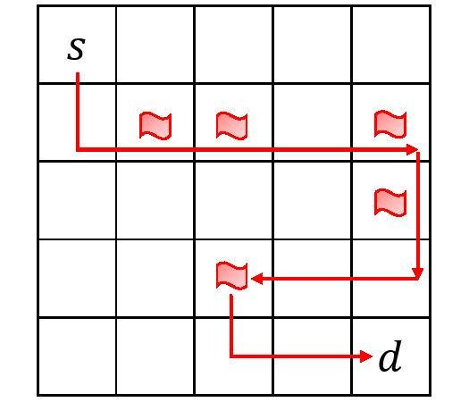

# Knowledge Compilation with RL

Code for the paper [**Integrating Knowledge Compilation with Reinforcement Learning for Routes**](https://ojs.aaai.org/index.php/ICAPS/article/view/16002/15813) published at the 31st [*International Conference on Automated Planning and Scheduling (ICAPS) 2021*](https://icaps21.icaps-conference.org/home/).

***

## Getting Started

### Minimum prerequisites

#### For the training code:

* Python 3 (>=3.6)
* Tensorflow (1.7)
* Numpy (1.13)
* Scipy (1.3)
* Pathos
* [Networkx](https://networkx.org/) (>=2.4)

#### For generating and manipulating SDDs:

* [Graphillion](https://github.com/takemaru/graphillion) 
* [PySDD](https://github.com/wannesm/PySDD)

To install prerequisites in bash 
```
bash install.sh
```
It is recommended to install all the dependencies in a conda environment.

## Running the code
To start the training process with default parameters and settings, run
```
python DCRL.py
```
in the kcrl/PythonScripts folder 

### Examples

<!--  -->


Consider a 5x5 open grid map with 5 landmarks indicated as flags. Use the default parameters to train the agent for this setting.

To test another setting, you will need to generate your own sdd/psdd and convert the sdd/psdd into intermediate json files using pypsdd/sdd2json.py script.

#### Steps to generate an sdd for an open grid 5x5 map
* Using Graphillion generate sets of all paths i.e. a GraphSet or a zdd (e.g., using ./scripts/grid.py).
* Construct a file that maps sdd variables (literals) to edges (e.g., using ./scripts/grid.py).
* Convert the above generated zdd into sdd using *zdd2sdd* script.
```
python zdd2sdd.py 5x5_icaps.zdd
```

#### Add constraints
* To add constraints (e.g., visiting some landmarks), generate another sdd using Graphillion. (Use the script landmarks_constraint.py)
* To combine the main sdd (sdd1) with the constraint sdd (sdd2), conjoin them using the conjoin operation in PySDD. (E.g.,`sdd1.conjoin(sdd2)`)

Note: To generate and manipulate decision diagrams for large maps (e.g. 10x10, 20x20), we used hierarchical clustering as defined in the papers [*Tractability in Structured Probability Spaces*](https://proceedings.neurips.cc/paper/2017/file/deb54ffb41e085fd7f69a75b6359c989-Paper.pdf) and [*Structured Bayesian Networks: From Inference to Learning with Routes*](https://ojs.aaai.org//index.php/AAAI/article/view/4796), and implemented in the C++ package [top-down compiler for binary hierarchical map](https://github.com/hahaXD/hierarchical_map_compiler). To multiply such decision diagrams we used the [PSDD](https://github.com/hahaXD/psdd) C++ package.
